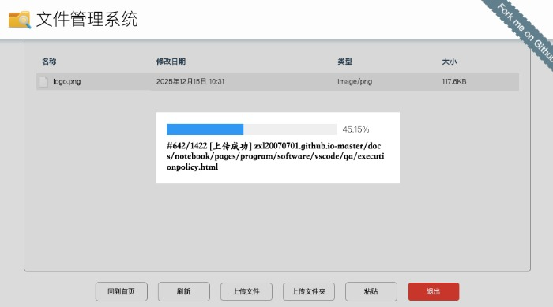

# [LLCloud](https://github.com/LL-Store/LLCloud)
🔥 文件或文件夹的上传、下载、ZIP文件压缩与解压、在线查看等

## 主要功能

### 用户界面

用户的登录、注册、找回密码


### 文件管理

文件或文件夹的上传、下载、打开、预览、解压缩、拖拽删除、复制、粘贴、剪切等



## 如何开发

开发的时候，直接运行如下命令：

```
npm run start:dev
```

然后浏览器访问： ```http://127.0.0.1:30000/index.html```

> 别忘了配置 `./src/config.ts` 中的邮箱SMTP信息。

## 生产环境

开发完毕以后，需要发布的话，首先进行打包：

```
npm run build
```

然后启动：

```
npm run start:prod
```

> 别忘了配置 `./dist/config.js` 中的邮箱SMTP信息。

## 版权

MIT License

Copyright (c) [zxl20070701](https://zxl20070701.github.io/notebook/home.html) 走一步，再走一步